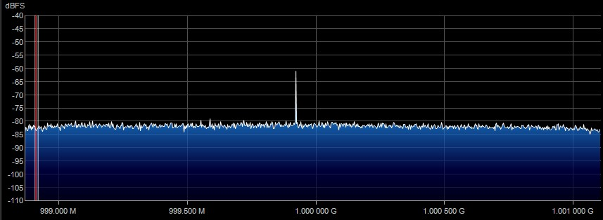

# BPT
## Hardware Setup
   
As seen in the diagram above, the Arduino is controlling the two ADF4351 boards via an SPI interface. This allows the Arduino to tell the boards which frequencies to output. The output of each board is then combined (added) with an RF Power Splitter, followed by an RF Amplifier and an RF High Pass Filter. The High Pass Filter is important for generating Beat Pilot Tones.   

## Using the Code
The `rf_gen/rg_gen.ino` file is responsible for interfacing with the ADF4351 board. Assuming the hardware is wired up correctly, you will need to run the code onto the Arduino and then open up the serial monitor. This can be done be navigating to **Tools->Serial Monitor** in the Arduino IDE.  

Once the code is uploaded you can use the user interface via the *Serial Monitor*. Here are a few examples   
### Manual Entry Mode

- First we entered an **m** to signify that we want to manually enter each frequency
- Next we enter the first frequency in MHz
- Then we enter the second frequency in MHz
- Finally we decide the noise mode. A noise mode of **n** will minimize the average noise level, where as a noise mode of **s** will minimize the noise spikes
   
Here are the resulting spectrums after the manual mode executes

### Frequency Sweep Mode

- This time we enter an **s** to begin with since we are sweeping
- Next we are asked for the low frequency (where the sweep begins)
- Then we enter the high frequency (where the sweep ends)
- Finally we specify how many MHz we want to incriment by on each iteration
- And again, we have the noise levels like the last example showed
- It is also worth noting that the sweep mode will also output the frequencies of each board (RFOUT0 and RFOUT1)
- Note that this will keep a constant difference of 127.8MHz between RFOUT0 and RFOUT1
   
Here is the resulting spectrum of one board after the sweep mode is executed:   
   

## Resources:
[ADF4351 Datasheet](https://www.analog.com/media/en/technical-documentation/data-sheets/ADF4351.pdf)  
[Original Code](http://f6kbf.free.fr/html/ADF4351%20and%20Arduino_Fr_Gb.htm)  
